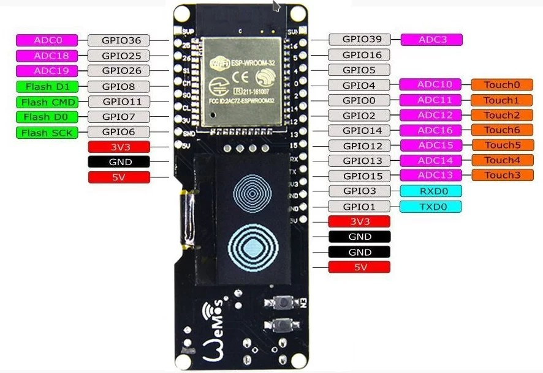

# ESP32-Smart-Controller

Repository with code for electronic project. 
I've used ESP32 WEMOS microcontroller with OLED and sensor BME 280. There is also relay module to switch pump on designated alarm.

# Information
- There is a config file data_ in which you should paste your credentials and data.
- You should connect ESP32 with devices like presented on schema.
- To be continued...

# Scheme
- ESP32 Wemos with OLED pinout
-  

# Note
- To be continued...

- Please remeber to use the latest NTP Client library created by Taranais [https://github.com/taranais/NTPClient](https://github.com/taranais/NTPClient). This library provide additional methods then original (ie. getFormattedDate()). For example to retrive data you can use formattedDate = timeClient.getFormattedDate();

- To be continued...
